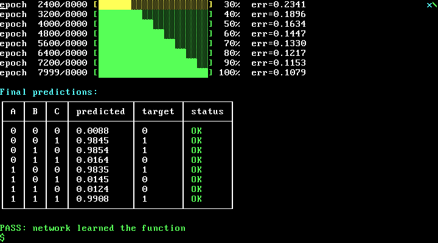
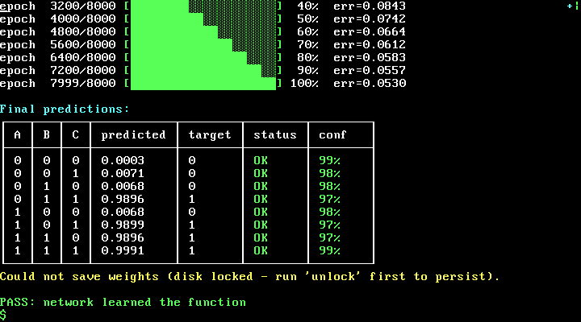
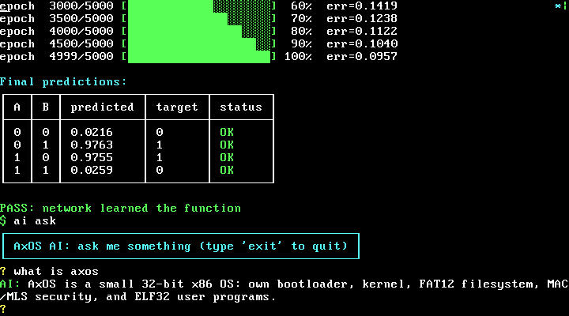

# AxOS

AxOS — экспериментальная учебная операционная система для x86 (32-битный
защищённый режим), написанная на NASM и C. Проект проходит весь путь от
загрузочного сектора до ядра с обработкой прерываний, страничной памятью,
пользовательским режимом (ring3), кучей и простой файловой системой — и даёт
интерактивную консоль, в которой всё это можно проверить вживую в QEMU.

## Возможности

- Собственный загрузчик: реальный режим (16 бит) → защищённый режим (32 бита)
- GDT с кольцами 0 и 3 + TSS для переключения стека ring3 → ring0
- IDT: таймер PIT (IRQ0, 100 Гц), клавиатура (IRQ1), `#PF` (page fault),
  `int 0x80` (системные вызовы)
- Страничная память: identity-map первых 4 МБ, `.text` ядра доступен только
  на чтение, `CR0.WP` включён
- Пользовательский режим (ring3): переход через `iretd`, обратно в ring0 —
  через `int 0x80` и TSS
- Куча: `malloc`/`free` (first-fit, разбиение и слияние блоков) на регионе
  384 КБ
- Preemptive round-robin планировщик (IRQ0): несколько задач ring0 и ring3,
  у каждой свой стек и свой стек ядра (per-task `TSS.ESP0`)
- FAT12-том на отдельном физическом диске (`build/disk.img`, через PIO IDE),
  чтение и запись — изменения переживают перезапуск QEMU
- Интерактивный shell с десятком команд (`help`, `ls`, `cat`, `memtest`,
  `usermode`, `ps`, ...)

## Технологии

- Языки: Assembler (NASM), C (GCC, `-m32 -ffreestanding`)
- Среда: Windows + `w64devkit` (MinGW: gcc, ld, objcopy)
- Инструменты: NASM (`tools/nasm.exe`), Python (генерация образа FAT12),
  QEMU (эмуляция `qemu-system-i386`)
- Архитектура: x86, 32-битный защищённый режим

## Быстрый старт

Сборка (Windows, из корня репозитория):

```bat
build.bat
```

`build.bat` сам подставляет `w64devkit\bin` в `PATH`, собирает все
ассемблерные и C-файлы, линкует их в `build\kernel.bin` и склеивает
`build\boot.bin` + `build\kernel.bin` в `build\os-image.bin` (дискета
1.44 МБ). Отдельно генерирует FAT12-образ из содержимого `fs/`
(`tools/make_fat12.py`) и записывает его в первые 256 КБ `build\disk.img`
(10 МБ, физический диск IDE).

Запуск в QEMU:

```bat
run.bat
```

или вручную:

```bat
qemu-system-i386 -drive format=raw,file=build\os-image.bin,if=floppy -boot a
```

После загрузки появится приглашение `AxOS> ` — наберите `help`, чтобы
увидеть список доступных команд.

## Архитектура

### Загрузка

1. **`src/boot/boot.asm`** (грузится BIOS по адресу `0x7C00`, реальный
   режим):
   - первым делом копирует себя целиком (все 512 байт сектора) на
     `0x0600` и продолжает выполнение оттуда (`jmp relocated_start +
     RELOC_DELTA`) - буфер чтения ядра (см. ниже) доходит до `0xC200`,
     то есть проезжает через `0x7c00`-`0x7e00`, где BIOS изначально
     положил сам загрузчик; без переезда входящие с диска данные
     переписывали бы код, который ещё не доисполнился, и BIOS молча
     зависал в середине `int 0x13` (не `jc`, без кода ошибки). `jc`/`jne`/
     `jmp`-на-метку в 16-битном режиме кодируются относительно
     (position-independent, работают и после переезда без изменений);
     вручную поправлены только абсолютные места - указатель на GDT
     (`gdt_descriptor`) и far jump в защищённый режим (`gdt.asm`,
     `switch_to_pm.asm`, обе через `RELOC_DELTA`);
   - переключает видеорежим в 80×25 текст;
   - читает ядро (89 секторов = 45568 байт) с диска в память по адресу
     `0x1000`;
   - подключает `src/kernel/gdt.asm` (таблица GDT, включая дескрипторы
     ring3-кода/данных и TSS) и `src/boot/switch_to_pm.asm`;
   - переключается в защищённый режим (`switch_to_pm`) и передаёт
     управление по адресу `0x1000` - абсолютным переходом через регистр
     (`mov eax, 0x1000` / `jmp eax`), а не `jmp 0x1000` с числовым
     литералом: NASM кодирует последний как relative jump, посчитанный
     под исходный (до-переезда) адрес - после самоперемещения это
     смещение неверное, переход улетал не туда.
2. **`src/kernel/kernel_entry.asm`** — точка входа `_start` (указана как
   `ENTRY` в `kernel.ld`): выставляет `esp = 0x90000` и вызывает
   `kernel_main()`.
3. **`kernel_main()`** (`src/kernel/kernel.c`) последовательно вызывает:
   `clear_screen()` → `init_idt()` → `init_paging()` → `init_tss()` →
   `init_heap()` → `init_tasking()` → `fat12_init()` (загружает FAT12-том
   с `build/disk.img` через IDE в RAM по `0x20000`), печатает приглашение
   `AxOS> ` и уходит в цикл `while(1) { hlt; }`, ожидая прерываний.

### GDT / IDT / прерывания

- **GDT** (`src/kernel/gdt.asm`): сегменты кода/данных ring0, сегменты
  кода/данных ring3 (`USER_CODE_SEG=0x18`, `USER_DATA_SEG=0x20`, DPL=3) и
  дескриптор TSS (`0x28`).
- **IDT** (`src/kernel/idt.asm`): обработчики
  - IRQ0 (таймер PIT, настроен на 100 Гц) — увеличивает `timer_ticks`,
    используется командами `uptime`/`sleep`;
  - IRQ1 (клавиатура) — читает скан-код через порт `0x60`, переводит в
    символ по таблице из `src/drivers/keyboard.h` и кормит командную строку;
  - `#PF` (исключение 14, page fault) — печатает адрес из `CR2` и
    останавливает систему (`page_fault_handler_main` в `paging.c`);
  - `int 0x80` — системные вызовы (см. ниже), шлюз с `DPL=3`, чтобы ring3
    мог его вызывать.

### Память: страничная организация и защита

`src/kernel/paging.c` отображает первые 4 МБ виртуальной памяти 1:1 на
физическую (одна таблица страниц на 1024 записи). Страницы, целиком лежащие
внутри `.text` ядра (от `0x1000` до конца кода, `_text_end` из `kernel.ld`),
помечаются как **read-only**; после этого включаются биты `CR0.PG` (paging) и
`CR0.WP` (write protect) — даже код ring0 не может случайно записать в
собственный код. Каталог страниц и таблица страниц размещены по фиксированным
физическим адресам (`0x9C000`/`0x9D000`), а не как статические массивы в
`.bss`, чтобы не раздувать `kernel.bin`.

### Пользовательский режим (ring3) и системные вызовы

`src/kernel/usermode.asm` (`enter_usermode`) готовит на стеке кадр для
`iretd` с селекторами ring3 (`CS|3`, `SS|3`) и переключает CPU в CPL=3 с
отдельным стеком `0x9B000`. Команда shell `usermode` демонстрирует переход в
ring3 и обратный вызов в ring0 через `int 0x80`.

`src/kernel/tss.c` настраивает TSS (`ESP0=0x90000`, `SS0=0x10`) по адресу
`0x9E000`: при прерывании/исключении/`int 0x80`, случившемся в ring3, CPU
переключает стек на стек ядра по этим значениям.

`src/kernel/syscalls.asm` — тонкий мост `int 0x80` → `syscall_dispatch()`
(`kernel.c`): сохраняет регистры, передаёт код функции (`AH`) и аргумент
(`ESI`) в диспетчер.

Коды функций и структуры аргументов определены в `src/user/syscall.h` —
общем заголовке для ядра и ring3-программ (`SYS_*`-константы).

| Код (`AH`) | Функция            | Аргумент (`ESI`)            |
|-----------:|---------------------|------------------------------|
| `0x01`     | `sys_print_string`  | указатель на C-строку (`\0`) |
| `0x02`     | `sys_clear_screen`  | не используется               |
| `0x03`     | `sys_read_key`      | указатель на `char` — последний нажатый символ (0, если нет); значение "потребляется" (сбрасывается в 0) |
| `0x04`     | `sys_write_file`    | указатель на `struct write_file_args { filename, data, size, result }` — создаёт/перезаписывает файл, `result`: 1 — записан, 0 — диск не готов/заблокирован или нет места |
| `0x05`     | `sys_read_file`     | указатель на `struct read_file_args { filename, buffer, max_size, out_size }` — `out_size` заполняется ядром |
| `0x06`     | `sys_exit`          | не используется — текущая задача завершается (см. "Жизненный цикл задач") |

### Куча (`src/kernel/heap.c`/`heap.h`)

Классический связный список блоков (`block_header_t { size, free, next,
magic, tag }`) над регионом `0x60000`–`0x90000` (192 КБ, свободен между
FAT12-образом и стеком ядра):

- `init_heap()` — один свободный блок на весь регион, вызывается один раз при
  старте ядра;
- `malloc(size)` — выравнивание до 4 байт, поиск первого подходящего
  свободного блока (first-fit), при избытке места — разбиение;
- `free(ptr)` — отправляет блок в карантин (см. ниже), а не сразу обратно в
  free-list.

Команда shell `memtest` прогоняет `malloc`/`free` через несколько сценариев
(выделение, переиспользование адреса после `free`, слияние блоков при
выделении большого блока) и печатает `PASS`/`FAIL` (с момента добавления
карантина немедленное переиспользование адреса больше не гарантировано —
тест печатает информационный `WARNING`, не считает это сбоем).

#### Усиление кучи: теги + карантин (software-аналог ARM MTE)

Настоящий ARM Memory Tagging Extension (4-битный тег на каждые 16 байт RAM,
аппаратная проверка через TBI — игнорирование верхних битов адреса при
трансляции) на x86 не портируется буквально: закодировать тег в старших
битах указателя, как делает ARM, сломало бы каждый вызов `malloc()` в
`kernel.c`/`tasking.c` — все они используют результат как обычный 32-битный
адрес, без аппаратного "снятия" тега. Вместо этого — software-only аналог,
проверяемый самим аллокатором (а не на каждом обращении к памяти):

- **magic** в заголовке отличает "выделенный блок" от "свободного"/"в
  карантине"/чужого мусора — `free()` отказывает на double-free и на
  указателе, чей заголовок не похож на блок, который выдавал этот же
  `malloc()`.
- **tag** (4 бита, "цвет" текущего поколения блока) вшит в канарейку
  (`tagged_canary`) сразу после пользовательских данных — переполнение,
  которое раньше тихо переписывало заголовок СЛЕДУЮЩЕГО блока, теперь
  детектируется в `free()` до того, как испорченный заголовок успеет что-то
  сломать.
- **Карантин** (кольцо на `QUARANTINE_CAPACITY` = 8 последних `free()`):
  блок не виден `malloc()`, пока не вытеснен из карантина (FIFO) — типичный
  use-after-free сразу после `free()` с большей вероятностью попадёт в блок,
  который ещё никто не успел переиспользовать. Отравление данных
  (фиксированным паттерном `0xDD`) и слияние с соседями происходят только
  при вытеснении из карантина, не в момент самого `free()` — это
  принципиально важно: `schedule()` (`tasking.c`) освобождает кадровый стек
  задачи, выполняющейся прямо сейчас НА ЭТОМ ЖЕ стеке (`ESP0`/CR3
  переключаются позже) — запись в блок непосредственно в `free()` означала
  бы запись под собственным текущим кадром вызовов (на этом и попался первый
  вариант реализации — раньше срабатывал triple fault на каждом выходе
  изолированной `run`-задачи).

При обнаружении double-free, чужого указателя или испорченной канарейки
ядро печатает `*** HEAP CORRUPTION: <причина> *** System halted.` и
останавливается (`hlt`-цикл) — детерминированный громкий отказ вместо тихой
порчи кучи.

### Многозадачность (tasking.c)

Preemptive round-robin планировщик: задачи — обычные C-функции с бесконечным
циклом, каждая на своём стеке (`malloc`, 4 КБ). Переключение происходит в
обработчике таймера (IRQ0, `idt.asm`): после `pusha` на стеке задачи остаётся
кадр `[pusha][EIP][CS][EFLAGS]` (и `[ESP][SS]`, если задача была в ring3) —
`schedule()` сохраняет текущий `esp`, выбирает следующую задачу по кольцу и
возвращает её `esp`; `popa`+`iret` резюмирует уже её.

- `task_create(name, entry)` — создаёт задачу ring0 (`CS=0x08`, кадр без
  привилегированного перехода).
- `task_create_user(name, entry)` — создаёт задачу ring3: на стеке ядра
  задачи собирается кадр `ring3 → ring0` (`CS|3`, `SS|3`, пользовательский
  стек), так что первый `popa`+`iret` сразу запускает её в CPL=3.
- У каждой задачи свой стек ядра (`KSTACK_SIZE`, 4 КБ) — `schedule()`
  обновляет `TSS.ESP0` (`tss_set_esp0()`, `tss.c`) под текущую задачу при
  каждом переключении, чтобы переходы `ring3 → ring0` (IRQ/`int 0x80`) одной
  задачи не портили стек другой.
- У каждой задачи свой `page_directory` (CR3) — для `task_create`/
  `task_create_user` это общий `PAGE_DIRECTORY` (`paging.h`, без изоляции),
  а для `task_create_user_isolated` — приватный PD/PT (см. ниже). При
  переключении на задачу с другим `page_directory`, чем у предыдущей,
  `schedule()` перезагружает CR3 (`mov %0, %%cr3`).

Две демо-задачи показывают работу планировщика прямо на экране: `heartbeat`
(ring0, символ `|/-\` в правом верхнем углу) и `ring3demo` (ring3, символ
`+x*.` рядом) — крутятся параллельно с основным shell. Команда `ps` печатает
список задач (`id`, имя, число тиков планировщика).

### Жизненный цикл задач (task exit/cleanup)

У каждой задачи (`task_t`, `tasking.c`) есть поля `user_slot_index` (-1 для
`task0`/`heartbeat`/`ring3demo`, 0..3 для `run`-задач) и `exiting` (0 —
работает, 1 — помечена на удаление). Оба пути завершения ниже просто
выставляют `exiting=1` через `task_mark_current_exiting()` — реальное
удаление происходит в `schedule()` на следующем тике таймера:

1. находит предшественника умирающей задачи в кольце и убирает её оттуда
   (`pred->next = next`);
2. если `user_slot_index >= 0` — зовёт `on_task_exit(idx)` (`kernel.c`),
   освобождая слот `run` (`slot_free[idx] = 1`);
3. освобождает (`free`) кадровый стек задачи и сам `task_t`.

Инвариант, который делает unlink безопасным без проверки "пустого
кольца": `exiting` выставляется только у `run`-задач —
`task0`/`heartbeat`/`ring3demo` никогда не завершаются, поэтому кольцо
планировщика никогда не опустеет.

**Добровольный выход — `SYS_EXIT` (`0x06`)**: `src/user/start.asm` после
`call _user_main` всегда выполняет `mov ah, 0x06; int 0x80`. Если
`user_main()` вернулась (как `exitdemo.c`), `sys_exit()` (`kernel.c`)
помечает текущую задачу на завершение. Для `hello.c` (бесконечный цикл в
`user_main`) этот код недостижим — поведение не меняется.

**Принудительный выход — kill при page fault в ring3**: `idt.asm`
передаёт в `page_fault_handler_main` указатель на кадр `pusha` (как и в
`schedule()`), откуда видны сохранённые `EIP`/`CS`. Если фолт произошёл в
ring3 у изолированной (`task_create_user_isolated`) задачи,
`page_fault_handler_main`:

- печатает `*** PAGE FAULT in '<name>' at 0x<addr> - task killed ***`;
- помечает задачу на завершение (`task_mark_current_exiting()`);
- перезаписывает `EIP` в кадре на `USER_SPIN_ADDR` — последние 2 байта
  окна задачи (`0x107FFE`), куда `task_create_user_isolated` записывает
  `jmp $` (`EB FE`) при создании задачи;
- возвращается (не виснет) — `iret` резюмирует ring3 на этом безопасном
  адресе (`PRESENT|RW|USER`, внутри своего окна), задача крутится в
  `jmp $`, "добивая" квант, до реапа в `schedule()` на следующем тике.

Начальный `ESP` изолированной задачи — `USER_WINDOW_TOP - 16`
(`USER_STACK_TOP`, `tasking.c`), а не сам верх окна: стек растёт вниз, и
первый push (`call _user_main` в `start.asm`) не должен затирать
`USER_SPIN_ADDR` до того, как он понадобится.

**"ASLR-подобный" разброс стека.** Полноценный ASLR (рандомизация базы
кода/данных) здесь недостижим без position-independent бинарников:
`user.ld` линкует все программы на фиксированный `0x100000`, абсолютные
ссылки в их коде это предполагают (см. "Изоляция памяти" выше). Зато
`task_create_user_isolated` сдвигает САМ СТАРТ стека на случайные 0–64
байта (кратно 16) вниз от `USER_STACK_TOP` — через xorshift32, перемешанный
с `timer_ticks` на каждый запуск (`STACK_ASLR_MAX_SHIFT`, `tasking.c`).
Эксплойт, рассчитанный на точный фиксированный адрес стека, промахивается;
сдвиг заведомо безопасен — между `USER_STACK_TOP` и блоком `argv`
(`USER_ARGS_VADDR`) около 1000 байт зазора.

Page fault в ring0 (баг ядра) или у встроенных демо-задач без изоляции
(`ring3demo`/`usermode`) — как и раньше, останавливает всю систему
(`*** PAGE FAULT at 0x... ***` / `System halted.`).

**Слоты `run`**: `slot_free[USER_PROGRAM_SLOTS]` (`kernel.c`) заменяет
прежний слепой round-robin — `run` ищет первый свободный слот; если все
4 заняты живыми задачами, печатает `No free program slots, try again
later.`.

**Демо**: `EXIT.BIN` (`src/user/exitdemo.c`) печатает строку и
возвращается из `user_main()` — проверяет `SYS_EXIT`/реап/освобождение
слота (`ps` после `run EXIT.BIN` вскоре больше не показывает задачу).
`CRASH.BIN` (`src/user/crashdemo.c`) печатает строку и пишет по адресу
`0x200000` (вне своего окна `0x100000`-`0x108000`) — проверяет kill-путь:
из `ps` исчезает только эта задача, `shell`/`heartbeat`/`ring3demo`
продолжают тикать.

### Файловая система (FAT12 на build/disk.img)

`src/fs/fat12.c`/`fat12.h` — драйвер FAT12-тома (256 КБ, 512 секторов,
507 кластеров данных по 512 Б), который физически живёт в первых 256 КБ
(LBA 0-511) `build/disk.img`. При старте ядра `fat12_init()` читает эти
512 секторов через `ide_read_sector` в RAM по адресу `0x20000` — дальше всё
работает с этой RAM-копией, как с обычным FAT12-томом. Сам том собирается из
файлов каталога `fs/` скриптом `tools/make_fat12.py` и записывается в
`build/disk.img` при сборке (`build.bat`).

Чтение: `fat12_list()` (команда `ls`), `fat12_cat(filename)` (команда `cat`)
и `fat12_load(filename, buffer, max_size)` (команда `run`, см. ниже).

Запись: `fat12_write(filename, data, size)` (команда `write`, см. ниже) —
создаёт файл (первая свободная/удалённая запись корневой директории) или
перезаписывает существующий (старая цепочка кластеров освобождается).
Кластеры под новые данные ищутся однопроходным сканированием FAT
(`fat12_alloc_chain`, без промежуточных массивов — важно при вызове из
syscall на 4 КБ стеке ring3-задачи) и линкуются на ходу; 12-битная запись
FAT-записей (`fat12_set_entry`) — та же арифметика read-modify-write, что
и `set_fat_entry` в `tools/make_fat12.py`. После успешной записи
`fat12_flush()` пишет всю RAM-копию обратно на `build/disk.img` через
`ide_write_sector` — изменения переживают перезапуск QEMU.

Если `build/disk.img` отсутствует или не содержит валидный FAT12-том,
`fat12_init()` возвращает 0, ядро печатает предупреждение и все команды
файловой системы (`ls`/`cat`/`write`/`run`) становятся no-op (флаг
`fat12_ready`).

**Защита от записи (`lock`/`unlock`)**: `fat12_set_locked()`/
`fat12_is_locked()` хранят флаг `fat12_locked` (по умолчанию 1 —
заблокировано). `fat12_write()` сразу возвращает 0, пока диск
заблокирован, — это касается и команды `write`, и `SYS_WRITE_FILE` из
ring3 (`sys_write_file`). Команда `unlock` снимает защиту, `lock`
восстанавливает её; текущее состояние видно в `about`. Чтение (`ls`,
`cat`, `run`) защитой не ограничено.

**Расширение FAT12 (256 КБ вместо 128 КБ).** Том изначально был 128 КБ
(256 секторов); статические файлы из `fs/` (демо-программы, `clip.bin` и
т.п.) выросли настолько, что заняли 250 из 252 кластеров данных — для
runtime-файла `selftest.c` (`test_fat12`, ~1100 байт = 3 кластера) не
осталось места, и регрессионный тест стал детерминированно проваливаться.
Объём подняли вдвое (512 секторов = 256 КБ, 507 кластеров данных), заодно
увеличив `SECTORS_PER_FAT` с 1 до 2 — один сектор FAT12 (12 бит/запись)
вмещает только ~340 записей, для 507+ кластеров уже не хватало. Три
константы должны двигаться синхронно при следующем расширении:
`TOTAL_SECTORS`/`SECTORS_PER_FAT` в `tools/make_fat12.py`,
`FAT12_TOTAL_SECTORS` в `src/fs/fat12.c`, и `HEAP_START` в
`src/kernel/heap.c` (должен оставаться выше конца RAM-копии FAT12 —
`FAT12_BASE + FAT12_TOTAL_SECTORS*512`).

### Запуск пользовательских программ (run)

Команда `run <file>` грузит файл с FAT12-диска в один из `USER_PROGRAM_SLOTS`
(4) слотов по `USER_PROGRAM_SLOT_SIZE` (32 КБ) каждый, начиная с
`USER_PROGRAM_BASE` (`0x100000`, 1 МБ) — `vfs_read()` — и запускает его как
изолированную ring3-задачу `task_create_user_isolated(filename, addr,
slot_index)` (`tasking.c`).

Сами программы линкуются так же, как `kernel.bin`: исходники в `src/user/`
(`crt0.asm` — точка входа `_start`, `hello.c` — `main()`, `user.ld` —
линковка на `0x100000`, `syscall.h` — общий ABI syscall'ов), собираются и
стрипуются в `build/hello.bin` (`objcopy -O binary`) — но дальше, в отличие
от ядра, `tools/make_elf.py` оборачивает этот плоский бинарник в
минимальный настоящий ELF32 (`Ehdr` + один `Phdr` PT_LOAD) перед тем, как
он попадёт в `fs/HELLO.BIN`. Имя файла в FAT12 не меняется (`.BIN`), меняется
только содержимое.

#### ELF32-загрузчик (`src/kernel/elf.c`/`elf.h`)

Toolchain этого проекта (`w64devkit/bin/ld.exe`) умеет линковать только в
PE — emulation `elf_i386` в нём нет. Конвертация уже слинкованного PE
через `objcopy -O elf32-i386` тоже не подходит: формально результат
проходит (верный `e_entry`/magic/class/machine), но **`p_vaddr` в Program
Header выходит мусорным** (`0xffd00000` вместо `~0x100000`) — проверено
вручную побайтовым разбором заголовка, известный класс багов binutils BFD
при PE→ELF с нестандартным image base. Поэтому `tools/make_elf.py` пишет
ELF32-контейнер сам — `Elf32_Ehdr` (52 байта) + один `Elf32_Phdr` (32
байта, `PT_LOAD`, `p_vaddr=p_paddr=0x100000`, `p_filesz=p_memsz=`размер
бинарника) + сами байты бинарника, по аналогии с тем, как `make_fat12.py`
вручную собирает FAT12.

На стороне ядра `elf_load()` (`do_exec()` и ветка `"run "` в
`execute_command()`, `kernel.c`) читает файл целиком во временный буфер
(`vfs_read`/`fat12_load` не умеют читать "со смещения"), разбирает
`Ehdr`/`Phdr`, копирует каждый `PT_LOAD`-сегмент по его `p_vaddr` в
физическую память слота программы и зануляет `[p_filesz, p_memsz)`.
Проверяются magic/class/data/machine/type, разумный потолок `e_phnum`, и
что ни один сегмент (и точка входа) не выходит за пределы окна задачи и
не залезает в зону `argv` (`USER_ARGS_OFFSET`) — отдельный код ошибки на
каждую причину отказа, как и у `mkdir`/`write`/`rm` (см. "Безопасность
файловых операций" выше). Результат — slot, или `-1` (файл не найден),
`-2` (нет свободных слотов), `-3` (не валидный ELF); `sh.c` показывает
для каждого отдельное сообщение.

**ВАЖНО про размер временного буфера**: буфер для разбора ELF (~32 КБ —
ровно потолок легального размера программы) живёт по фиксированному
физическому адресу (`ELF_STAGING_BASE = 0x128000`, сразу после
`PT_POOL_BASE`), а НЕ как статический массив в `.bss` ядра. На практике
это поймали живьём: `.bss` ядра начинается сразу после `.data`
(`kernel.bin` грузится с `0x1000`), а GDT загрузочного сектора в тот
момент физически жила по `0x7c00`-`0x7e00`; 32 КБ статического буфера в
`.bss` утащили `__bss_end` далеко за `0x7c00`, и `rep stosb`,
обнуляющий `.bss` при старте, стирал GDT — `#GP` → `#DF` → Triple fault
прямо во время загрузки. Тот же класс бага, что когда-то уже ловили на
самом `.bss` ядра. При добавлении новых крупных статических буферов в
`kernel.c` — фиксированный физический адрес в свободной зоне (как
`PAGE_DIRECTORY`/`PAGE_TABLE`/`PD_POOL_BASE`/`PT_POOL_BASE`), не `.bss`.
(С тех пор `boot.asm` сам себя копирует на `0x0600` перед чтением ядра —
GDT там больше не живёт на `0x7c00`, см. "Загрузка" выше, но привычка
проверять `__bss_end` после новых буферов остаётся правильной.)

#### Изоляция памяти (приватный Page Directory на процесс)

`task_create_user_isolated` строит для задачи приватный Page Directory +
Page Table (`paging_create_user_directory`, `paging.c`) — копию глобальной
PT, но с **`PAGE_USER` сброшенным везде** (ring3 этой задачи по умолчанию не
видит ни код/данные ядра, ни кучу, ни видеопамять, ни слоты других программ
- любое такое обращение вызовет page fault), кроме виртуального окна
`0x100000`-`0x108000` (8 страниц = `USER_PROGRAM_SLOT_SIZE`), которое
переотображается на физический слот `0x100000 + slot_index * 0x8000`
программы с флагами `PRESENT|RW|USER`. `EIP` и `ESP` изолированной задачи —
всегда виртуальные `0x100000`/`0x108000`: код, данные и стек программы
живут только в этом окне (32 КБ суммарно), независимо от того, в каком
физическом слоте она на самом деле загружена. `schedule()` переключает CR3
на этот PD при возврате к задаче (см. "Многозадачность" выше).

Приватные PD/PT берутся из пула `PD_POOL_BASE`/`PT_POOL_BASE` (`paging.h`,
`0x120000`-`0x128000` — сразу за слотами программ, по 4 КБ+4 КБ на каждый
из `USER_PROGRAM_SLOTS`).

Побочный эффект: раньше все 4 слота были видны программе по их настоящим
физическим адресам, а `user.ld` линкует программы на фиксированный
`0x100000` — поэтому абсолютные ссылки на данные (строки и т.п.) в
программе, загруженной в слот 1-3, указывали на `0x100000+offset`
(т.е. в слот 0), и "работали" только потому, что во всех слотах лежала
идентичная копия `hello.bin`. Переотображение окна исправляет это: теперь
такие ссылки всегда корректно резолвятся в "свой" слот.

`task0` (shell), `heartbeat` и `ring3demo` (встроенные ring0/ring3
демо-задачи, код которых — часть `kernel.bin`, пишут прямо в видеопамять)
продолжают использовать общий `PAGE_DIRECTORY` без изоляции — изоляция
применяется только к `run`-задачам.

**Завершение при ошибке**: page fault в ring3 у изолированной `run`-задачи
больше не останавливает всю систему — убивается только эта задача (см.
"Жизненный цикл задач" выше). Page fault в ring0 (баг ядра) или у
встроенных демо-задач без изоляции (`ring3demo`/`usermode`) — по-прежнему
останавливает ОС: такой fault обычно сигнализирует баг ядра и должен быть
заметен.

`HELLO.BIN` демонстрирует все ring3-syscall'ы: печатает приветствие,
записывает файл `RING3.TXT` через `SYS_WRITE_FILE`, читает его обратно
через `SYS_READ_FILE` и печатает прочитанное (доказывая, что запись и
чтение через FAT12 из ring3 работают), затем в цикле опрашивает
клавиатуру через `SYS_READ_KEY` (неблокирующе) и эхо-печатает нажатые
символы — независимо от обычного ввода shell. Диск по умолчанию
заблокирован от записи (см. ниже) — выполните `unlock` перед `run
HELLO.BIN`, иначе `SYS_WRITE_FILE` ничего не запишет и `SYS_READ_FILE`
вернёт пустую строку.

Каждый `run` занимает следующий слот по кругу — несколько программ могут
работать одновременно (видно в `ps`). После полного круга слот
переиспользуется: `run` перезапишет программу, которая занимала этот слот
раньше, если она ещё работает. Для учебной ОС без отдельных адресных
пространств на задачу это ожидаемо.

### Драйвер IDE/ATA (PIO)

`src/drivers/ide.c`/`ide.h` — PIO-драйвер ATA для primary bus, master-диска,
LBA28-адресация. Без DMA и прерываний: чтение и запись секторов через порты
`0x1F0`-`0x1F7` с поллингом регистра статуса (`ide_wait_ready`/`ide_wait_data`,
ограничены `IDE_WAIT_LIMIT` итерациями, чтобы не зависнуть, если IDE-устройство
не подключено — `status == 0xFF`).

- `ide_read_sector(lba, buffer)` / `ide_write_sector(lba, buffer)` — команды
  `READ SECTORS` (`0x20`) / `WRITE SECTORS` (`0x30`), 256 слов (512 байт) за
  раз; после записи — `CACHE FLUSH` (`0xE7`).
- `ide_identify(model)` — команда `IDENTIFY DEVICE` (`0xEC`), возвращает строку
  модели диска (слова 27-46 ответа).

Это настоящий физический диск — `build/disk.img` (10 МБ, создаётся при
сборке и подключается к QEMU как `if=ide`). Диск разделён на две области:

- **LBA 0-511** (первые 256 КБ) — FAT12-том, который `fat12_init()`/
  `fat12_flush()` грузят и сохраняют целиком (см. раздел про FAT12 выше).
  Не трогайте эту область через `diskread`/`diskwrite` — `write`/`run`
  работают с ней через FAT12-драйвер.
- **LBA ≥512** — свободное место для демонстрации `diskread <lba>`/
  `diskwrite <lba> <text>` напрямую через IDE, без FAT12.

Команды shell: `diskinfo`, `diskread <lba>`, `diskwrite <lba> <text>` (см.
таблицу команд ниже; для демо используйте `lba >= 512`). Записи через
`diskwrite` сохраняются между запусками QEMU. VFS-слой над несколькими
файловыми системами — следующий шаг (см. Roadmap).

## Карта памяти

Все адреса — физические, в пределах identity-mapped первых 4 МБ:

| Адрес              | Размер     | Назначение                                   |
|--------------------|------------|-----------------------------------------------|
| `0x1000`–`0xC200`  | ≤ 45568 Б  | `.text`/`.data`/`.bss` ядра (`kernel.bin`), read-only после `init_paging()` |
| `0x20000`–`0x60000`| 256 КБ     | RAM-копия FAT12-тома (`fat12_init`/`fat12_flush` через IDE с `build/disk.img`) |
| `0x60000`–`0x90000`| 192 КБ     | Куча (`malloc`/`free`)                         |
| `0x90000`          | ↓ растёт вниз | Стек ядра (начальный `esp`, он же `ESP0` в TSS) |
| `0x9B000`          | 4 КБ       | Стек пользовательского режима (ring3)          |
| `0x9C000`          | 4 КБ       | Page Directory                                 |
| `0x9D000`          | 4 КБ       | Page Table (1024 записей, покрывает 4 МБ)      |
| `0x9E000`          | 104 Б      | TSS                                             |
| `0xA0000`–`0xFFFFF`| —          | Зарезервировано (видеопамять `0xB8000`, BIOS)  |
| `0x100000`–`0x120000`| 4×32 КБ  | Слоты загрузки пользовательских программ (команда `run`, `vfs_read`) |
| `0x120000`–`0x128000`| 4×(4КБ+4КБ) | Пул приватных Page Directory/Page Table для изолированных `run`-задач (`PD_POOL_BASE`/`PT_POOL_BASE`, `paging.h`) |
| `0x128000`          | ~32 КБ     | Буфер разбора ELF-файла программы перед загрузкой (`ELF_STAGING_BASE`, `kernel.c`) — фиксированный адрес, не `.bss` (см. "ELF32-загрузчик") |

## Команды shell

| Команда         | Описание                                                  |
|-----------------|------------------------------------------------------------|
| `help`          | список команд                                              |
| `clear`         | очистить экран                                             |
| `about`         | информация об ОС (версия, статус блокировки FAT12-диска)   |
| `date` / `time` | текущая дата и время (CMOS RTC)                            |
| `uptime`        | время с момента загрузки (тики PIT, 100 Гц)                |
| `sleep <0-9>`   | пауза на N секунд                                          |
| `reboot`        | программная перезагрузка                                   |
| `echo <text>`   | вывод текста                                               |
| `ls`            | список файлов на FAT12 RAM-диске                           |
| `cat <file>`    | содержимое файла                                           |
| `write <file> <text>` | создать/перезаписать файл на FAT12 RAM-диске (нужен `unlock`) |
| `lock`          | защитить FAT12 RAM-диск от записи (по умолчанию)           |
| `unlock`        | разрешить запись на FAT12 RAM-диск                          |
| `run <file>`    | загрузить и запустить программу с FAT12 (ring3); `No free program slots, try again later.`, если все 4 слота заняты живыми задачами |
| `usermode`      | демо: переход в ring3 и вызов `int 0x80` из user mode      |
| `memtest`       | тест кучи (`malloc`/`free`): выделение, переиспользование, слияние блоков |
| `selftest`      | регрессионные тесты heap/paging/FAT12, печатает `SELFTEST: ALL PASS`/`FAILED` |
| `ps`            | список задач планировщика (id, имя, число тиков)           |
| `diskinfo`      | модель диска IDE (`build/disk.img`), команда `IDENTIFY DEVICE` |
| `diskread <lba>`| hexdump сектора с диска IDE (первые 128 из 512 байт)       |
| `diskwrite <lba> <text>` | записать текст в сектор диска IDE                  |

## Буфер обмена (`clip`/`paste`)

`SYS_CLIPBOARD_SET`/`SYS_CLIPBOARD_GET` (`0x1F`/`0x20`, `kernel.c`) — один
общий буфер обмена в ядре (до `CLIPBOARD_MAX_SIZE` = 1 КБ - исторически
ограничен из-за близости `.bss` ядра к загрузочному сектору 0x7c00, где
раньше жила GDT, см. `kernel_entry.asm`; после самоперемещения `boot.asm`
на `0x0600` это конкретное ограничение уже не актуально само по себе, но
лимит не пересматривался), переживающий завершение задач. Доступен из AxSH
(`sh.bin`, см. "Запуск пользовательских программ"):

| Команда                | Описание                                              |
|------------------------|--------------------------------------------------------|
| `clip set <text>`      | записать текст в буфер обмена (`fs/CLIP.BIN`)          |
| `clip get`             | вывести содержимое буфера обмена (`fs/CLIP.BIN`)       |
| `clip clear`           | очистить буфер обмена (`fs/CLIP.BIN`)                  |
| `clip level <N> set <text>` | поднять себе MLS-уровень до `sN` (0-15) и сразу записать на нём — см. "MLS" ниже |
| `clip level <N> get`   | поднять себе MLS-уровень до `sN` и сразу попытаться прочитать |
| `clip level <N> idle <ms>` | поднять себе MLS-уровень до `sN` и поспать `ms` мс — демо для `ps`/`task_info` (см. "MLS" ниже) |
| `paste`                | алиас `clip get`, встроен прямо в `sh.c` — отдельный `.bin` для однострочного алиаса не оправдывает свои ~4.6 КБ накладных расходов на crt0/libaxiom (см. "Расширение FAT12" ниже) |

## MAC: Type Enforcement в духе SELinux (`kernel.c`)

Настоящий SELinux — Linux Security Module: хуки на inode/dentry/socket/
capability внутри Linux-ядра, security-контексты, политику грузит userspace.
Ничего из этого в AxOS нет и не может быть буквально — это не Linux и не
AOSP. Реализован тот же ПРИНЦИП (Type Enforcement: субъект в домене, объект
в классе, политика "домен × класс → разрешено/запрещено", default-deny),
нативно для собственных ресурсов ядра — без претензии на совместимость с
настоящим SELinux.

- **Домены** (`ax_domain_t`) — как security context процесса: изолированные
  `run`-задачи (`task_current_is_isolated()`, т.е. вообще все программы,
  загруженные через `run`/AxSH) — confined `user_t`; ядро и неизолированные
  демо-задачи (`heartbeat`/`ring3demo`) — unconfined `kernel_t`.
- **Классы** (`ax_class_t`) — по одному на syscall, который решили confine, в
  `kernel.c`:

  | Класс           | Syscall(ы)                                              | Политика для `user_t` |
  |-----------------|----------------------------------------------------------|------------------------|
  | `disk_raw`      | `SYS_DISK_READ_SECTOR`/`WRITE_SECTOR`/`SYS_DISK_IDENTIFY` (минуя FAT12) | deny |
  | `system_reboot` | `SYS_REBOOT`                                              | deny |
  | `file_write`    | `SYS_WRITE_FILE`, `SYS_OPEN` (флаг ≠ `O_RDONLY`), `SYS_MKDIR` | allow |
  | `file_unlink`   | `SYS_UNLINK`                                              | allow |
  | `fs_lock`       | `SYS_FS_LOCK` (`lock`/`unlock`)                           | allow |
  | `exec`          | `SYS_EXEC`/`SYS_EXEC_REDIR`                               | allow |
  | `clipboard`     | `SYS_CLIPBOARD_SET`                                       | allow (но см. MLS ниже) |
  | `task_info`     | `SYS_PS` (имена/`heap_brk` ДРУГИХ задач — info-disclosure поверхность) | allow |

  Только первые два реально запрещены — остальные пять allow-правил
  (как и большинство правил в настоящей политике SELinux): запрещать
  повседневные операции AxSH и демо-программ (`write.bin`/`rm.bin`/`mkdir.bin`/
  `lock`/`unlock`) без причины означало бы ломать рекламируемую
  функциональность. Ценность — единообразная, проверяемая граница для
  каждой операции, которую можно сузить позже без правок в самих `sys_*`.
- При отказе `ax_mac_check()` печатает audit-подобную строку (формат — привет
  от настоящего `avc: denied` в `dmesg`/`auditd`) и возвращает 0; syscall
  отказывает вызывающему как при любой другой ошибке (`result=0`) — с точки
  зрения вызывающего denied неотличим от обычного отказа, как и в реальном
  SELinux.

```
avc:  denied  { disk_raw }  for comm="disktool.bin"  scontext=axos:user_t  tclass=disk_raw
```

Добавление новой confined-операции — это новый класс в `ax_class_t` + строка
в `ax_policy` + вызов `ax_mac_check(...)` в начале нужного `sys_*`.

### MLS: уровни чувствительности (`SYS_SET_LEVEL`, буфер обмена)

Полный security context в SELinux — `user:role:type:level`, где `level`
(MLS/MCS) — отдельная "шкала" чувствительности (`s0`..`s15`, опционально с
категориями `c0`..`c1023`), проверяемая ПОВЕРХ Type Enforcement через
доминирование (Bell-LaPadula: субъект должен доминировать над объектом,
чтобы его прочитать — "no read up"). Добавлена аналогичная шкала для одного
конкретного ресурса — буфера обмена:

- `SYS_SET_LEVEL` (`0x21`) — задача поднимает СЕБЕ MLS-уровень (`s0`..`s15`,
  `task_set_current_mls_level()`, `tasking.c`). Самодекларация без проверки
  полномочий: в AxOS нет ни аутентификации, ни ролей, которые могли бы её
  ограничить (в отличие от настоящего SELinux MLS, где переход уровня сам
  подчинён политике) — честно задокументированное упрощение, как и 4-битный
  tag кучи (см. "Куча" выше).
- Каждый успешный `SYS_CLIPBOARD_SET` "окрашивает" буфер уровнем ПИСАТЕЛЯ
  (`clipboard_level`, `kernel.c`). `SYS_CLIPBOARD_GET` отказывает
  (`out_size=0` + `avc: denied { read } ... (MLS: no read up)`), если уровень
  читателя ниже уровня, на котором буфер был заполнен последний раз.
- Поднятый уровень живёт только до конца ЭТОГО процесса (как и контекст
  процесса в SELinux — не переживает следующий `exec`). Поэтому `clip.bin`
  совмещает подъём уровня и операцию в одном запуске:

  ```
  $ run CLIP.BIN level 5 set top secret    # пишет на s5
  $ run CLIP.BIN get                       # читатель на s0 (по умолчанию) - denied
  $ run CLIP.BIN level 5 get                # читатель s5 >= s5 - "top secret"
  ```

**Вторая защищённая поверхность: `ps` (класс `task_info`).** Каждая задача
несёт собственный MLS-уровень (`task_t.mls_level`, по умолчанию `s0`).
`SYS_PS` отдаёт ту же dominance-проверку (`ax_mls_dominates(level, "task")`)
по каждой записи: задачу с уровнем выше уровня наблюдателя видно (запись не
пропадает из списка — иначе цикл `ps.bin` прервался бы раньше времени), но
её `NAME`/`TICKS`/`heap_brk` заменены на `<hidden>`/`0`/`0x0` — наблюдатель
не узнаёт о ней ничего, кроме самого факта существования (тот же принцип,
что у `hidepid` в Linux/Android).

Поскольку свежий `ps` всегда стартует на `s0`, продемонстрировать редакцию
нужно ДВУМЯ процессами: один поднимает себе уровень и остаётся живым
(`clip.bin level N idle <ms>`, в фоне через `&`), второй (`ps`) смотрит на
него со стороны:

```
$ CLIP.BIN level 5 idle 9000 &
[1] bg
$ ps
   5  <hidden>             0  user:1  heap=0x0
avc:  denied  { read }  for comm="ps.bin"  scontext=axos:user_t:s0  tcontext=axos:object_r:task:s5  (MLS: no read up)
```

## Цвет в AxSH (`screen.c`, ANSI SGR)

`screen.c` уже умел разбирать ANSI escape-последовательности (`\033[...m`
для цвета, `\033[2J`/`\033[r;cH` для очистки/позиционирования курсора) —
просто никто их не использовал. Подсветка добавлена туда, где она помогает
сразу видеть результат, без декоративных красивостей:

- зелёный (`\033[32m`) — приглашение AxSH (`$`/`[dir]$`), успешные
  операции (`disk: unlocked`, `clip: set N bytes`, `-> file` после
  редиректа);
- циан (`\033[36m`) — баннер `AxSH v0.1`, `Goodbye.`;
- жёлтый (`\033[33m`) — фон-задачи (`[N] bg`), kill изолированной задачи
  при page fault (предупреждение, не фатально — система продолжает работать);
- красный (`\033[31m`) — `sh: not found`/`no free slots`/`cd: not found`,
  `avc: denied` (MAC/MLS, `kernel.c`), `*** HEAP CORRUPTION ***`/
  `*** PAGE FAULT ... System halted.` (фатальные остановки системы).

## AI-демо: нейросеть учит булеву функцию (`ai.bin`, `src/user/ai.c`)



*`ai 01101001` (parity/XOR трёх входов, дефолт без аргументов): прогресс-бар
обучения (красный → жёлтый → зелёный по мере убывания ошибки) и финальная
таблица предсказаний с колонками A/B/C.*



*`ai 00010111` (majority — выход 1, если хотя бы 2 из 3 входов единицы) —
сходится заметно быстрее parity, т.к. линейно разделима.*

`ai` (запускается прямо из AxSH или `run AI.BIN` из kernel-shell) — живое
обучение крошечного многослойного перцептрона (3 входа → 6 скрытых
нейронов → 1 выход, обучение обратным распространением ошибки) предсказывать
любую из 256 булевых функций трёх аргументов. Таблица истинности (8 бит —
выходы для входов 000,001,010,011,100,101,110,111) задаётся либо аргументом
командной строки (`ai 01101001` — parity/XOR3, `ai 00000001` — AND,
`ai 00010111` — majority, и т.д.; невалидный аргумент — 8 символов `0`/`1`
обязательны — печатает предупреждение и откатывается на parity), либо
интерактивно: без аргументов `ai` запрашивает 8-битную строку через
`ax_readline` (Enter без ввода — тоже parity). Перед обучением печатает
распознанное имя функции — но, в отличие от версии на 2 входа (16 функций,
исчерпывающая таблица `KNOWN_FNS`), у 3 входов 256 функций, и именами
покрыты только несколько "известных" (AND/OR/NAND/NOR/XOR-parity/XNOR/
MAJORITY/FALSE/TRUE) — остальные lookup помечает как `custom (no common
name)`. Parity и XNOR — самые сложные из известных: не линейно разделимы
(обобщение контрпримера Минского/Паперта 1969 года на 3 входа), отсюда и
скрытый слой.

**Веса переживают выход из программы**: после успешного обучения сеть
сохраняет веса на FAT12 в `AI.WTS` — следующий запуск `ai` с тем же
8-битным паттерном находит совпадение, грузит готовые веса и сразу
показывает таблицу предсказаний, без повторного обучения и без
прогресс-бара (баннер показывает `Loaded:` вместо `Training:`). Файл —
не одни веса под одну функцию, а "банк" из `BANK_SIZE`=8 слотов
(`weights_bank_t`/`save_weights()`/`load_weights()`): можно обучить
parity, потом majority, потом AND — каждая своя, без переобучения при
переключении между уже выученными паттернами (`ai list` показывает,
что сейчас в банке — паттерн и распознанное имя для каждого занятого
слота). Когда банк полон и совпадения нет, новый паттерн вытесняет
слот по кругу (`next_slot`, простой FIFO, без учёта реального времени
последнего использования). Запись требует разблокированного диска
(команда `unlock` в AxSH — FAT12 заблокирован на запись по умолчанию,
`fat12_locked=1`, см. "Файловая система" выше); если диск заблокирован,
`ai` просто предупреждает и работает как раньше — чтение `AI.WTS` не
требует `unlock`. Несошедшуюся модель (`all_ok=0`) не сохраняет.

**Никакого `float`/`double`**: в этом freestanding-окружении FPU не
инициализирован (нет `fninit`, `CR0.EM` не сброшен) и вектор `#NM` (7) не
обработан в `init_idt()` (`kernel.c`) — любая x87-инструкция тут же
положила бы систему тройным сбоем (проверено явно: float не используется
вообще ни в одном файле проекта). Вся арифметика — fixed-point Q16.16
(`fx_mul()` — `((long long)a*b) >> 16`, без `libgcc`-хелперов: 32×32→64 —
один аппаратный `imul`, проверено линковкой). Сигмоида — через таблицу из
512 точек на домене `[-8, 8)`, посчитанную заранее в Python и
вкомпилированную как `static const int[]` — без `exp()` в рантайме.

Веса инициализируются своим xorshift32 (как ASLR-генератор в `tasking.c`,
но отдельная userspace-копия), сидится `ax_get_ticks()` — на каждом запуске
свои случайные веса. На 2 входа было достаточно 4 скрытых нейронов и 5000
эпох (проверено на 200 случайных сидах в Python-прототипе: 200/200
сходится); на 3 входа сложность задачи выше (256 функций вместо 16,
parity/XNOR требуют различать более тонкие комбинации входов) — подняли до
6 нейронов и 8000 эпох. Системной статистики по сходимости на множестве
сидов для 3-входовой версии нет (в отличие от 2-входовой) — проверено
вручную в QEMU на parity и majority, оба раза сошлось с первой попытки.

**UI**: баннеры (`print_boxed()`) рисуются рамкой из CP437 box-drawing
символов (`\xDA`/`\xC4`/`\xBF`/...) — аппаратный VGA-текстовый шрифт
всегда содержит CP437 независимо от настроек ОС, так что это не мусор,
а реальные линии. Каждые 800 эпох (8000 всего) печатается живой
прогресс-бар (`print_progress_bar()`, блоки `\xDB`/`\xB0`), цвет полосы
меняется по величине ошибки — красный (`err > 1.0`), жёлтый
(`0.2-1.0`), зелёный (`< 0.2`). Финальные предсказания — таблица с
рамкой (те же box-drawing символы, `PRED_TABLE_WIDTHS`, 6 колонок —
`PRED_TABLE_COLS`) с колонками A/B/C/predicted/target/status,
`OK`/`FAIL` подсвечены зелёным/красным; выравнивание ячеек — через свой
`print_padded()` (ширина берётся из переменной, а не из литерала
формата, как требует `%-Ns` у `ax_printf`). Цвет в ячейке `status` не
портит выравнивание: ANSI-escape'ы печатаются отдельными вызовами
вокруг `print_padded()`, а не внутри её аргумента, так что в видимую
ширину поля не попадают. Таблица обучения (8 строк, ~34 строки вывода
вместе с прогресс-баром) длиннее 25-строчного VGA-экрана — баннер с
именем функции успевает уехать за экран до конца обучения, это
нормально, не баг.

### `ai ask` — Q&A-режим про сам AxOS



Отдельный режим, не имеющий отношения к MLP выше: `ai ask` запускает REPL
(жёлтый `? ` — приглашение, `exit`/`quit` — выход), где пользователь
печатает вопрос на английском (клавиатурный драйвер — только ASCII/US-layout,
см. `scancode_to_char[]` в `kernel.c`), а `ai.bin` ищет ответ в жёстко
заданной базе `QA_DB` (вопрос → до 3 ключевых фраз → ответ) простым
поиском подстроки (`contains()`, регистронезависимо через
`lower_copy()`) — никакого обучения, ML или нейросети тут нет, это
обычный lookup. Первое совпадение по порядку записей в `QA_DB`
побеждает; если ни одна ключевая фраза не нашлась — печатается
дефолтный ответ со списком тем (axos, xor, fpu, syscalls, fat12, mac,
mls, elf, neurons). Ответ выводится с зелёным префиксом `AI:`, баннер —
в той же рамке `print_boxed()`, что и у тренировочного режима.

## Структура репозитория

### Используется текущей сборкой (`build.bat`)

- `src/boot/boot.asm` — загрузчик (реальный режим → защищённый режим, чтение
  ядра с диска).
- `src/boot/switch_to_pm.asm` — переключение в защищённый режим (подключается
  через `%include` из `boot.asm`).
- `src/lib/string.asm` — строковые функции для загрузчика (`%include` из
  `boot.asm`).
- `src/kernel/gdt.asm` — таблица GDT (ring0/ring3 сегменты + TSS),
  подключается через `%include` из `boot.asm`.
- `src/kernel/kernel_entry.asm` — точка входа `_start`, вызывает
  `kernel_main()`.
- `src/kernel/idt.asm` — таблица прерываний и низкоуровневые обработчики
  (таймер, клавиатура, page fault, `int 0x80`).
- `src/kernel/syscalls.asm` — мост `int 0x80` → `syscall_dispatch()`.
- `src/kernel/usermode.asm` — переход в ring3 (`enter_usermode`).
- `src/kernel/kernel.c` — основная логика ядра: инициализация, shell,
  обработчики прерываний на C, таблица syscall'ов.
- `src/kernel/screen.c` — вывод текста, скроллинг, `clear_screen`,
  `backspace`.
- `src/kernel/paging.c`/`paging.h` — страничная память, identity-map,
  read-only `.text`, `#PF`-обработчик, `paging_create_user_directory`
  (приватный PD/PT для изолированных `run`-задач).
- `src/kernel/tss.c`/`tss.h` — настройка TSS (переключение стека
  ring3 → ring0).
- `src/kernel/heap.c`/`heap.h` — `malloc`/`free`.
- `src/kernel/tasking.c`/`tasking.h` — preemptive round-robin планировщик
  (`task_create`, `task_create_user`, `task_create_user_isolated`,
  `schedule`).
- `src/kernel/selftest.c`/`selftest.h` — регрессионные тесты heap/paging/FAT12
  (команда `selftest`, `run_self_tests`).
- `src/kernel/vfs.c`/`vfs.h` — тонкий VFS-слой (vtable `vfs_driver_t`):
  `kernel.c`/`selftest.c` обращаются к `vfs_*`, единственный
  зарегистрированный драйвер - FAT12.
- `src/fs/fat12.c`/`fat12.h` — драйвер FAT12-тома на `build/disk.img`
  (`fat12_init`/`fat12_flush` через IDE, чтение и запись).
- `src/drivers/ide.c`/`ide.h` — PIO-драйвер ATA/IDE (primary master, LBA28),
  доступ к `build/disk.img` (команды `diskinfo`/`diskread`/`diskwrite`).
- `src/drivers/keyboard.h` — порты ввода-вывода и таблица скан-кодов
  клавиатуры.
- `src/user/syscall.h` — общий ABI системных вызовов (`SYS_*`-константы и
  структуры аргументов) для ядра и ring3-программ.
- `src/user/start.asm`, `src/user/user.ld` — общая точка входа `_start`
  (вызывает `user_main()`, затем `SYS_EXIT`) и линковка на `0x100000` для
  всех ring3-демо.
- `src/user/hello.c`, `src/user/exitdemo.c`, `src/user/crashdemo.c` —
  исходники демо-программ, собираются в `build/*.bin` и копируются в
  `fs/HELLO.BIN`/`fs/EXIT.BIN`/`fs/CRASH.BIN`. `hello.c` — бесконечный цикл
  (демонстрирует syscalls, `run HELLO.BIN`), `exitdemo.c` — нормальный
  выход через `SYS_EXIT` (`run EXIT.BIN`), `crashdemo.c` — выход за пределы
  своего окна → page fault → kill (`run CRASH.BIN`). См. "Жизненный цикл
  задач".
- `kernel.ld` — линкер-скрипт (`ENTRY(_start)`, секции начинаются с `0x1000`).
- `fs/` — содержимое FAT12-раздела (`MOTD.TXT`, `STARTUP.CFG`), упаковывается
  `tools/make_fat12.py`. `fs/HELLO.BIN` генерируется при сборке (см. выше) и
  не хранится в git (`*.bin` в `.gitignore`).
- `tools/make_fat12.py`, `tools/nasm.exe` — генератор FAT12-образа и
  ассемблер.
- `tools/smoke_test.py`, `tools/regression_test.py`,
  `tools/exec_regression_test.py`, `tools/ai_ask_regression_test.py` —
  headless-тесты в QEMU через monitor (`smoke_test.py` — загрузка до
  шелла, `regression_test.py` — команда `selftest`, `exec_regression_test.py`
  — ELF-загрузчик: `echo` с аргументами и через AxSH/`ax_exec`, и через
  kernel-shell `run` — у `selftest` нет своего покрытия `do_exec`/`run`,
  без этого теста загрузчик проверялся бы только косвенно, через
  автозапуск AxSH; `ai_ask_regression_test.py` — режим `ai ask`: точное
  совпадение по ключевой фразе, совпадение по одному "голому" ключевому
  слову, дефолтный ответ при отсутствии совпадений, и чистый `exit`
  обратно в AxSH-промпт); общий код (`find_qemu`/`decode_vga`/`send_text`/
  `launch_qemu`/`dump_screen`) вынесен в `tools/qemu_test_helpers.py` —
  раньше каждый тест нёс свою копию, и именно расхождение копий
  (забытый `.lower()` для `sendkey`) стало причиной первого же бага в
  `exec_regression_test.py`. Используются в CI.
- `build.bat` — основной скрипт сборки, `run.bat` — запуск в QEMU.

### Легаси / не используется текущей сборкой

Эти файлы остались от ранних экспериментов и **не подключены** в
`build.bat` — не удаляются, чтобы не терять историю, но при доработке ядра
ориентируйтесь на список выше:

- `src/boot/boot_kernel.asm`, `src/boot/disk_load.asm` — альтернативный
  второй этап загрузчика и низкоуровневое чтение диска.
- `src/kernel/kernel_start.asm`, `src/kernel/ui_colors.asm` — старая точка
  входа ядра и константы цветов интерфейса.
- `src/drivers/gui.asm`, `src/drivers/print_string.asm`, `src/drivers/ui.asm`,
  `src/drivers/screen.h` — ранние варианты экранного вывода (заменены на
  `screen.c`).
- `src/lib/io.asm`, `src/lib/math.asm`, `src/lib/mem.asm`, `src/lib/print.asm`
  — низкоуровневые утилиты из ранних версий загрузчика.
- `linker.ld`, `build.bat.bak`, `build_cp866.bat`, `build_en.bat`,
  `build_simple.bat`, `run_with_devkit.bat` — старые варианты линкер-скрипта
  и сборочных скриптов (`run_with_devkit.bat` зовёт `build_simple.bat`).

## Формат итогового образа

Подробности и историю формата см. в [`docs/image-format.md`](docs/image-format.md).
Текущий `build.bat` собирает `build/os-image.bin` (1.44 МБ, как дискета)
так:

1. `build/boot.bin` + `build/kernel.bin` склеиваются друг за другом
   (`copy /b`);
2. файл дополняется нулями до `1 474 560` байт (1.44 МБ).

QEMU запускает образ как floppy (`-drive format=raw,file=build\os-image.bin,if=floppy -boot a`).

Отдельно `build/disk.img` (10 МБ, физический диск IDE) содержит в первых
256 КБ (LBA 0-511) FAT12-том, сгенерированный `tools/make_fat12.py` из
содержимого `fs/` (`build/fat12.bin`) — его грузит `fat12_init()` через IDE
при старте ядра.

## Текущий статус

- ✅ Загрузчик: реальный режим → защищённый режим, чтение ядра с дискеты.
- ✅ GDT/IDT, таймер PIT (100 Гц), клавиатура через IRQ.
- ✅ Страничная память: identity-map 4 МБ, `.text` read-only, `CR0.WP`.
- ✅ Ring3 + TSS + `int 0x80` (системные вызовы с `DPL=3`).
- ✅ Куча: `malloc`/`free` с разбиением и слиянием блоков; усиление в духе
  hardened_malloc/GrapheneOS — magic+канарейка-с-тегом против double-free/
  overflow, карантин из 8 последних `free()` (см. "Куча" выше).
- ✅ "ASLR-подобный" разброс начального стека изолированных `run`-задач
  (см. "Запуск пользовательских программ").
- ✅ MAC (Type Enforcement в духе SELinux), 8 классов, + MLS-уровни
  чувствительности для буфера обмена (см. разделы "MAC"/"MLS" выше).
- ✅ Preemptive round-robin планировщик (ring0 и ring3 задачи, per-task `TSS.ESP0`) + команда `ps`.
- ✅ FAT12-том на `build/disk.img` через IDE (чтение и запись, персистентно)
  + команды `ls`/`cat`/`write`.
- ✅ Загрузчик пользовательских программ с FAT12 (команда `run`,
  настоящий ELF32 — см. "ELF32-загрузчик"), каждая — в своём приватном
  Page Directory (изоляция памяти).
- ✅ Системные вызовы для ring3: чтение клавиатуры, чтение/запись файлов.
- ✅ Жизненный цикл задач: `SYS_EXIT` при нормальном выходе, kill при page
  fault изолированной задачи (без halt всей системы), реап и
  переиспользование слотов `run`.
- ✅ Интерактивный shell с десятком команд.
- ⏳ Дальнейшие шаги — см. Roadmap.

## Roadmap (планы развития)

- **Сделано:**
  - ✅ `CONTRIBUTING.md` и `LICENSE` (MIT);
  - ✅ `build.bat` — полная автоматическая сборка `os-image.bin`;
  - ✅ FAT12 RAM-диск (только чтение);
  - ✅ страничная память + защита `.text` от записи (`CR0.WP`);
  - ✅ ring3 + TSS + системные вызовы через `int 0x80`;
  - ✅ куча (`malloc`/`free`);
  - ✅ preemptive round-robin планировщик: задачи ring0 и ring3, per-task
    `TSS.ESP0`, команда `ps`.
  - ✅ CI (GitHub Actions): сборка `build.bat` + headless smoke-test в QEMU.
  - ✅ загрузчик пользовательских программ из FAT12 (команда `run`,
    плоские бинарники, см. `src/user/`), 4 слота по 32 КБ
    (`0x100000`-`0x120000`) — несколько программ работают одновременно.
  - ✅ запись в FAT12-раздел (команда `write`, `fat12_write` — выделение и
    освобождение цепочек кластеров, создание/перезапись записей в корневой
    директории);
  - ✅ новые системные вызовы для ring3: `SYS_READ_KEY` (неблокирующее
    чтение клавиатуры), `SYS_WRITE_FILE`/`SYS_READ_FILE` (файлы из ring3),
    общий ABI в `src/user/syscall.h`.
  - ✅ базовый PIO-драйвер IDE/ATA (`src/drivers/ide.c`/`ide.h`): чтение и
    запись секторов (LBA28), `IDENTIFY DEVICE`, отдельный физический диск
    `build/disk.img`, команды `diskinfo`/`diskread`/`diskwrite`.
  - ✅ защита FAT12-диска от записи (`fat12_set_locked`/`fat12_is_locked`,
    диск заблокирован по умолчанию): команды `lock`/`unlock`, `write` и
    `SYS_WRITE_FILE` отказывают, пока диск заблокирован; статус виден в
    `about`.
  - ✅ интеграция FAT12 с реальным диском (`build/disk.img` через `ide.c`):
    `fat12_init()` грузит FAT12-том (LBA 0-511) в RAM при старте ядра,
    `fat12_write()` после успеха зовёт `fat12_flush()` — файлы переживают
    перезапуск QEMU; при отсутствии/невалидности диска `fat12_ready=0` и
    команды файловой системы становятся no-op.
  - ✅ регрессионные тесты heap/paging/FAT12 (команда `selftest`,
    `src/kernel/selftest.c`/`selftest.h`): переиспользует `memtest_demo`
    для кучи, проверяет биты `CR0`/записи таблицы страниц после
    `init_paging()`, читает/пишет FAT12-файл (один и несколько кластеров) и
    проверяет блокировку записи; печатает `SELFTEST: ALL PASS` или
    `SELFTEST: FAILED`. `tools/regression_test.py` гоняет `selftest` в QEMU
    и проверяет итоговую строку — отдельный шаг CI "Regression tests in
    QEMU".
  - ✅ минимальный VFS-слой (`src/kernel/vfs.c`/`vfs.h`): vtable
    `vfs_driver_t` (`init`/`is_ready`/`is_locked`/`set_locked`/`list`/`cat`/
    `read`/`write`), один глобальный `vfs_root`, привязанный к FAT12.
    `kernel.c` и `selftest.c` обращаются только к `vfs_*`, не зная про
    `fat12_*` напрямую — логика FAT12 не менялась. Без путей и
    mount-point'ов: один драйвер, имена файлов в формате "name.ext".
  - ✅ изоляция памяти `run`-задач: приватный Page Directory/Page Table на
    процесс (`task_create_user_isolated`, `paging_create_user_directory`).
    Виртуальное окно `0x100000`-`0x108000` переотображается на физический
    слот программы, всё остальное (ядро, куча, видеопамять, другие слоты)
    помечено `PAGE_USER=0` — недоступно из ring3 (page fault). `schedule()`
    переключает CR3 при смене `page_directory`. Побочный эффект: исправлен
    скрытый баг с абсолютными адресами для слотов 1-3 (см. раздел "Запуск
    пользовательских программ"). `task0`/`heartbeat`/`ring3demo` — без
    изоляции (общий `PAGE_DIRECTORY`).
  - ✅ жизненный цикл задач (task exit/cleanup): добровольный выход
    (`SYS_EXIT`, `0x06`) при возврате из `user_main()`, принудительный kill
    при page fault в ring3 у изолированных `run`-задач (перенаправление
    `EIP` на безопасный `jmp $` в своём окне вместо halt всей системы),
    реап в `schedule()` (удаление из кольца, `free` стека/`task_t`,
    освобождение слота `run` через `slot_free[]`/`on_task_exit`). Демо:
    `EXIT.BIN`, `CRASH.BIN`.
  - ✅ усиление кучи: magic в заголовке блока + канарейка, завязанная на
    4-битный generation-тег ("цвет" блока, software-аналог тегов ARM MTE —
    см. "Куча" выше), карантин на 8 последних `free()` перед возвратом блока
    в free-list. `*** HEAP CORRUPTION: ... *** System halted.` на
    double-free/чужом указателе/переполнении.
  - ✅ "ASLR-подобный" разброс начального `ESP` изолированных `run`-задач
    (0-64 байта, xorshift32 от `timer_ticks`, `tasking.c`) — см. "Запуск
    пользовательских программ".
  - ✅ MAC (Type Enforcement в духе SELinux): домены (`kernel_t`/`user_t`) ×
    8 классов (`disk_raw`, `system_reboot`, `file_write`, `file_unlink`,
    `fs_lock`, `exec`, `clipboard`, `task_info`) × статическая политика,
    default-deny, audit-подобный лог при отказе (`kernel.c`) — см. раздел
    "MAC" выше.
  - ✅ MLS-уровни (`SYS_SET_LEVEL`, `s0`-`s15`) с dominance-проверкой
    ("no read up") для буфера обмена — см. "MLS" выше.
  - ✅ настоящий ELF32-загрузчик пользовательских программ
    (`src/kernel/elf.c`/`elf.h`, `tools/make_elf.py`) вместо плоских
    бинарников: разбор `Ehdr`/Program Header Table, копирование сегментов
    по `p_vaddr`, точка входа из `e_entry`, отдельные коды ошибок на
    каждую причину отказа — см. "ELF32-загрузчик" выше.
  - ✅ AI-демо (`ai.bin`, `src/user/ai.c`): крошечный MLP (3-6-1) учится
    предсказывать любую из 256 булевых функций трёх аргументов (таблица
    истинности — аргументом командной строки или интерактивно) обратным
    распространением ошибки, целиком на fixed-point Q16.16 (без FPU);
    обученные веса переживают выход из программы — банк из 8 слотов на
    FAT12 (`AI.WTS`, `ai list` показывает содержимое); плюс отдельный
    режим `ai ask` — Q&A по жёстко заданной базе про сам AxOS (поиск
    подстроки, без ML) — см. "AI-демо" выше.

- **Долгосрочно:**
  - многодрайверная VFS с путями и mount-point'ами — если/когда появится
    вторая файловая система.

## Контрибьюции

Подробное руководство для контрибьюторов доступно в [`CONTRIBUTING.md`](CONTRIBUTING.md).

Кратко:
1. Сделайте форк репозитория.
2. Создайте ветку по шаблону `feature/имя` или `fix/имя`.
3. Добавьте описание изменений и, если меняли ядро, проверьте `build.bat` и
   проверку в QEMU (`run.bat`).

### Стиль и требования

- Assembler: NASM-style, `[bits 32]`/`[bits 16]` явно, комментарии на русском
  для нетривиальных мест (по аналогии с `paging.c`/`heap.c`).
- C: совместимость с `gcc -m32 -ffreestanding -mno-sse -mno-sse2 -mno-mmx`
  (см. флаги в `build.bat`). Без libc — только то, что реализовано в самом
  ядре.
- Перед PR: убедитесь, что `build.bat` проходит без ошибок и `kernel.bin`
  не превышает 45568 байт (лимит — 89 секторов, которые грузит `boot.asm`).

### PR: оформление и чек-лист ревью

- Описание: кратко что сделано и почему.
- Сборка: `build.bat` проходит локально без ошибок.
- Проверка: загрузка в QEMU (`run.bat`), нет `*** PAGE FAULT ***` и тройных
  сбоев; затронутые команды shell проверены вручную.
- Документация: обновлён `README.md` или добавлены docs в `docs/`, если
  менялась архитектура/карта памяти/список команд.
- Если изменение большое — откройте issue перед реализацией.

## Troubleshooting

### Ошибка "NASM не найден"
- Используйте локальную копию `tools\nasm.exe` (её уже использует
  `build.bat`) или установите NASM и добавьте в `PATH`.

### Ошибка "gcc"/"ld"/"objcopy не найден"
- Установите `w64devkit` в корень репозитория (папка `w64devkit/`) —
  `build.bat` сам добавляет `w64devkit\bin` в `PATH`.

### `kernel.bin` слишком большой / `boot.bin` не грузит ядро целиком
- `boot.asm` читает с диска ровно 89 секторов (45568 байт) под ядро. Если
  `build\kernel.bin` больше — урежьте код/данные или увеличьте число секторов
  в `boot.asm`.

### `build\fat12.bin` не создаётся / `tools\make_fat12.py` падает
- Убедитесь, что установлен Python и доступен в `PATH`.
- Проверьте содержимое каталога `fs/` (`MOTD.TXT`, `STARTUP.CFG`).

### QEMU не запускается
- Установите QEMU для Windows и поправьте путь в `run.bat`
  (`C:\Program Files\qemu\qemu-system-i386.exe`) или используйте
  `qemu-system-i386`, если он есть в `PATH`.
- Используйте `qemu-system-i386` (не `x86_64`) — образ собран как 32-битная
  дискета.

### `*** PAGE FAULT at 0x... ***` в QEMU
- Обращение к памяти за пределами identity-mapped первых 4 МБ либо запись в
  страницу `.text` (read-only после `CR0.WP`). Проверьте адреса в коде,
  который вы добавили, относительно [карты памяти](#карта-памяти).

---

Лицензия: MIT.
